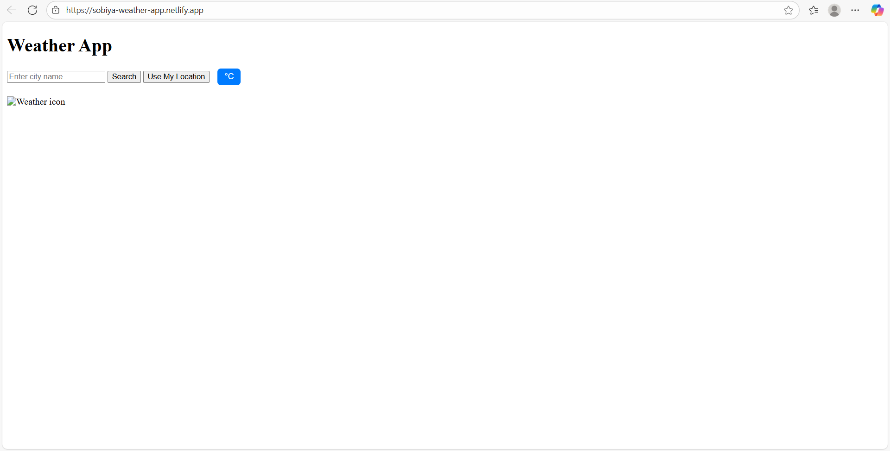
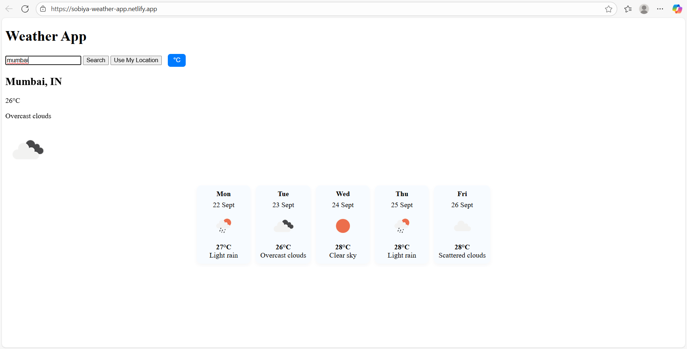
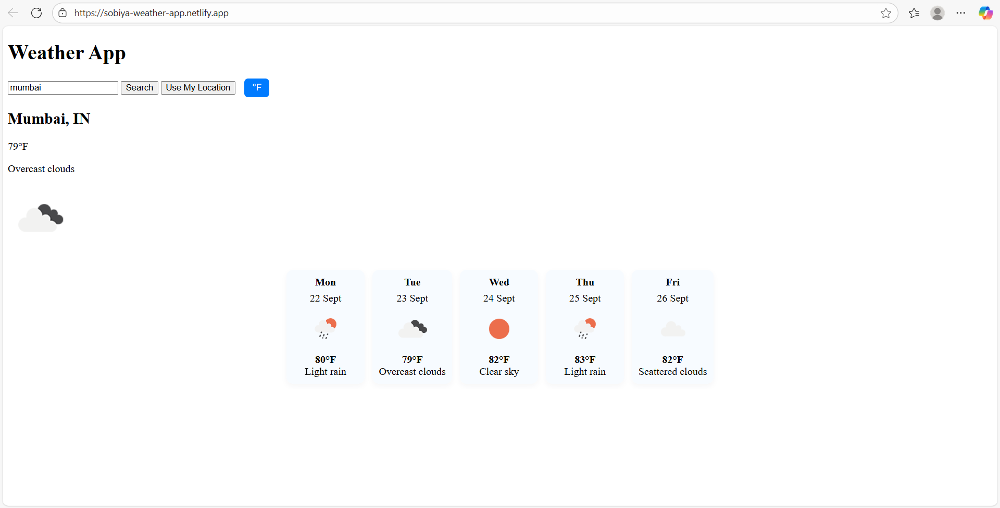

# 🌦️ Weather App  

A simple and responsive weather application that allows users to check real-time weather information and a 5-day forecast for any city worldwide.  
The app uses the **OpenWeather API** to fetch data and provides an easy-to-use interface where users can search by city name or detect their current location.  
It also includes a toggle to switch between **Celsius** and **Fahrenheit**, making it convenient for a global audience.  

🔗 **Live Demo**: [Weather App on Netlify](https://sobiya-weather-app.netlify.app)  

---

## ⚙️ Tech Stack  
- **HTML5**  
- **CSS3**  
- **JavaScript (Vanilla JS)**  
- **OpenWeather API**  

---

## ✨ Features  
- 🔍 Search weather by **city name**  
- 📍 Detect weather using **current location (Geolocation)**  
- 🌡️ Toggle between **Celsius & Fahrenheit**  
- 📅 Shows **5-day forecast with icons**  
- 📱 Responsive design  

---

## 📸 Screenshots  

### 🏠 Home Page  
  

### 🌡️ Weather in Celsius  
  

### 🌡️ Weather in Fahrenheit  
  

---
👩‍💻 Author

Sobiya Begum
🔗 GitHub Profile

## 🚀 Setup & Installation  

1. Clone the repository:  
   ```bash
   git clone https://github.com/sobiya57/weather-app.git
   cd weather-app
